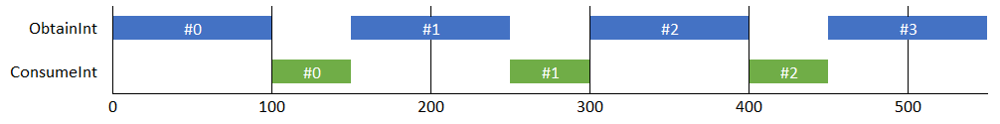
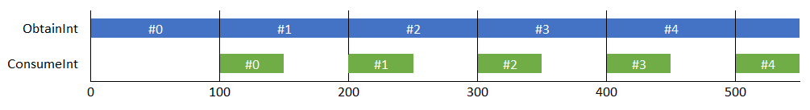

# EagerAsyncEnumerable

Provides an implementation of [IAsyncEnumerable&lt;T&gt;](https://learn.microsoft.com/en-us/dotnet/api/system.collections.generic.iasyncenumerable-1)
that eagerly enumerates over its supplied source, internally queueing all results, before an item
is even requested from it.

## Why would you want this?

Say you've got an `IAsyncEnumerable`, and each iteration over it takes a long time to complete.
Meanwhile, your consumer of these items also operates asynchronously, and it also takes a long time
to complete.

The idea is, while your consumer is busy processing a result returned from the source
`IAsyncEnumerable`, why not go ahead and produce the next item from your source `IAsyncEnumerable`
at the same time? You can have items queued and immediately ready the moment the consumer is
available to process another item. **EagerAsyncEnumerable** makes it easy to do this without
needing to manually stickhandle the tasks and the queue.

One real-world example could be making a series of API calls, and with each, saving the data to a
database. The API calls could be slow, the database processing could also be slow. So, while doing
the database processing, why not start up that next API call at the same time?

# Example

Say you have an `IAsyncEnumerable` like this:
```
private async IAsyncEnumerable<int> ProduceInts()
{
	for (int i = 0; i < 10; i++)
	{
		await Task.Delay(100);
		yield return i;
	}
}
```

And your consumer is like this:

```
private async Task ConsumeInt(int i)
{
	await Task.Delay(50);
	Console.Write($"Value {i} saved to database.");
}
```

So, it takes **100ms** to produce an int, and **50ms** to consume one of those ints.

Let's say you do your processing like this:

```
private async Task ProcessInts()
{
	var myInts = ProduceInts();
	await foreach (var item in myInts)
	{
		await ConsumeInt(item);
	}
}
```

The problem with this is that all the awaiting is done one after the other. You'll produce an int,
which takes 100ms, and then you'll process it, which takes 50 ms. Then you await the next, which
takes 100ms, and you process that, which takes 50ms, etc etc.



The total time spent would be (approx) **1500ms**. (_1000ms_ for producing the ints, plus an extra
_500ms_ for processing them).

Considering those two methods have nothing to do with one another, why not start producing another
int while the consumer is working?

Now, you could achieve this by manually grabbing the enumerator and stickhandling the tasks
yourself, but wouldn't it be nice if you could just do the same `await foreach` as above and just
have it work?

That's what **EagerAsyncEnumerable** provides.

```
private async Task ProcessInts()
{
	var myInts = ProduceInts().AsEagerEnumerable();
	await foreach (var item in myInts)
	{
		await ConsumeInt(item);
	}
}
```

This time, the moment your enumeration starts (as part of the `await foreach`),
**EagerAsyncEnumerable** will start enumerating over the entire source `ProduceInts`, in a
background thread, queueing all the results before they are requested. That leaves this thread
free to consume items at the same time this loading occurs. Thus, each time you iterate over this
`await foreach`, **EagerAsyncEnumerable** can immediately return, synchronously, whatever
it has queued, potentially saving a bunch of time since the consumer won't have to wait. Of course,
if nothing is queued, it would wait for the producer, no different than if you weren't using
**EagerAsyncEnumerable**.

In essence, the producer `ProduceInts` runs in parallel with the consumer `ConsumeInt`.




This operation will only take (approx) **1050ms** total, as all the `ConsumeInt` methods (except
the last) will run at the same time as the `ProduceInts` method is providing another int.

## How does this differ from `Parallel.ForEach`?

When you use [Parallel.ForEach](https://learn.microsoft.com/en-us/dotnet/api/system.threading.tasks.parallel.foreach),
you are asking to process **_all_** the items in the source sequence **_at the same time_**,
in-parallel.

**EagerAsyncEnumerable**, meanwhile, will still only process, at most, **_one_** item from the
source sequence at a time. It merely does this enumeration in the background before the consumer
requests it.

# Catches

### Catch #1 - Items in your IAsyncEnumerable need to be processed one-at-a-time, in order.
**EagerAsyncEnumerable** is intended to be used with a simple `await foreach` loop, where you take
one item at a time. If you can operate all those tasks at the same time, in parallel, you will get
better performance out of
[Parallel.ForEach](https://learn.microsoft.com/en-us/dotnet/api/system.threading.tasks.parallel.foreach),
or [Tasks.WhenAll](https://learn.microsoft.com/en-us/dotnet/api/system.threading.tasks.task.whenall).

### Catch #2 - Your producer does not depend on the consumer in order to run to completion.
Since **EagerAsyncEnumerable** will eagerly load the next item before the consumer requests it,
it's important that its operation doesn't depend on the results of your consumer in order to run.
For example, if the consumer saves a value in a database to indicate state, and the next call to
the producer depends on that value, you cannot use **EagerAsyncEnumerable**, as the producer could
race ahead before the consumer saves that value, breaking your state.

### Catch #3 - Both your consumer and your producer run asynchronously.
If either your producer or your consumer effectively run synchronously, or take a miniscule amount
of time to finish, there's absolutely no benefit to using this. You are creating overhead for no
gain, as this would run no faster than just iterating over your base `IAsyncEnumerable`.

### Catch #4 - Cancelling likely means ignoring what the Producer did.

**EagerAsyncEnumerable** loads the entire enumerable before you request it, so obviously if you
cancel part-way through consuming it, your source enumerable still might have been ran all the way
to completion. At best, you wasted time loading all those items for absolutely nothing. At worst,
this could leave your business data in an inconsistent state, if it wasn't supposed to perform that
extra enumeration.

Like using `Parallel.ForEach` or `Tasks.WhenAll`, clearly if you use this, you expect cancelling to
not be a normal operation, but an exceptional one, and you know there won't be consequences of
doing so.


## Is there really a benefit to using a queue?

You might see this implementation and wonder if it's overly complicated. Couldn't we achieve the
same results by caching only a single move at a time, instead of all of them?

Take the above example. The producer, `ProduceInts`, takes longer than the consumer, `ConsumeInt`.
Because of this, every time you produce an item, the consumer will consume it, and sit waiting for
the next one. It's impossible that you'll ever have more than 1 item that would be queued at a
time. Thus, rather than having a queue at all, why not just cache the task to move to the next
item, await that when the consumer requests it, then move to the next one before yielding the
result? Same results, much less complexity, no need for a queue.

And even if the producer was the fast one, it'd be no different. Let's say `ProduceInts` takes
**50ms** and `ConsumeInts` takes **100ms**. Sure, you could queue multiple items from `ProduceInts`
while `ConsumeInts` is running, but ultimately `ConsumeInts` is going to be the bottleneck. The
best it can do is consume one int every 100ms. Thus, it still takes 1050ms to run: 50 ms for the
first produce, then 1000ms to consume the 10 ints. Whether you produce & queue all the ints at the
very beginning of the program, or you only produce one while the consumer is running makes
absolutely no difference.

The reality is, if your producer and consumer are predictable in how long they take, there really
is no benefit to queuing anything. Because one side, the producer or consumer, is always going to
be the bottleneck, you can only move as fast as that.

Nonetheless my implementation still uses a queue. Why? For when it's unpredictable. Say consuming
the first item takes a really long time for some reason, but all the other instances are
comparatively quick. At that point, since the producer went ahead and queued a bunch, the consumer
can just zip through all of them one after the other without having to wait on the producer.

Now, in normal operation, your producer and consumer _probably_ won't be so unpredictable as to
notice. But, even in benchmarking, there's not much overhead to using a queued approach. The CPU
usage is dwarfed by your asynchronous operation, exactly as you'd expect. And it only requires
a few extra allocations for the queue. So, quite simply, it doesn't detract to use it, but it could
potentially really benefit, so why not use it?

And let's face it, the real world really isn't so predictable. API slowdowns, DB slowdowns, who
knows what could happen.

## How To Use

It's as easy as calling the `AsEagerEnumerable` extension method on any of the following:
- [IAsyncEnumerable&lt;T&gt;](https://learn.microsoft.com/en-us/dotnet/api/system.collections.generic.iasyncenumerable-1)
- `IEnumerable<Task>`
- `IEnumerable<Task<T>>`
- `IEnumerable<ValueTask>`
- `IEnumerable<ValueTask<T>>`

Then, use `await foreach` as you otherwise would.

Or, alternatively, you can use the `GetEagerEnumerator` extension if you'd rather work directly
with the [IAsyncEnumerator&lt;T&gt;](https://learn.microsoft.com/en-us/dotnet/api/system.collections.generic.iasyncenumerator-1).
Just note that using this will immediately start loading from the source, before you even make the
first `MoveNextAsync` call. That could be a good thing, or a bad thing, depending.

You can optionally supply a [CancellationToken](https://learn.microsoft.com/en-us/dotnet/api/system.threading.cancellationtoken),
as you desire, but don't forget: you cannot predict how many items were _**actually**_ iterated
over your source enumerable the moment you cancel. So long as that won't cause you any state
problems or issues with your business data, go right ahead and cancel as required.

Basically, use `CancellationToken` for exceptions, like a user explicitly desiring to cancel, or
some sort of operational failure. 
